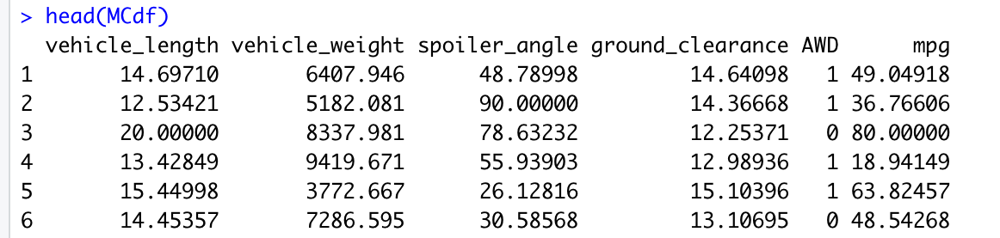
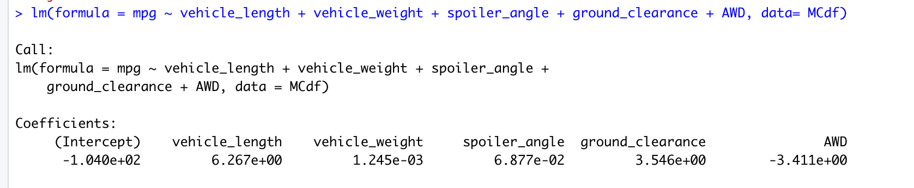
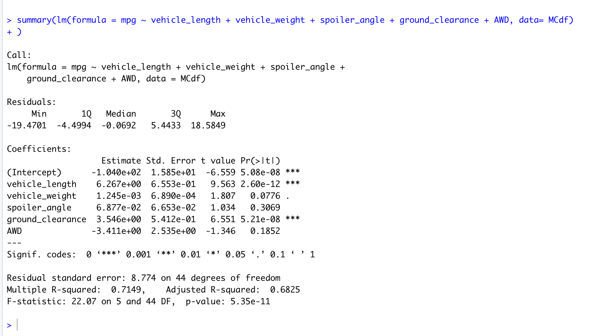

# **MechaCar_Statistical_Analysis**
*mini description*

## Overview of Project:
#### *Purpose:*

## Linear Regression to Predict MPG:

1. Which variables/coefficients provided a non-random amount of variance to the mpg values in the dataset?
- vehicle_weight, spoiler_angle, and AWD

2. Is the slope of the linear model considered to be zero? Why or why not?
- No, the slop of the linear model is not considered to be zero due to the p-value.

3. Does this linear model predict mpg of MechaCar prototypes effectively? Why or why not?
- Yes (sort-of). The linear model will correctly predit mpg of MechaCar prototypes approximatly 71% of the time. This prediction comes from the Multiple R-Square. The Adjusted R-Squared is approximatly 68%. In addition to the 6 factors used in this model, there could be additional factors that would affect the prediction of MechaCar prototypes. Ultimatly, the effectiveness should be compared to a predetermined goal/measure of effectiveness.

## Results 
#### *Process:*
#### *Analysis:*
## Summary:

