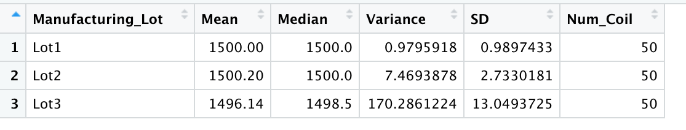
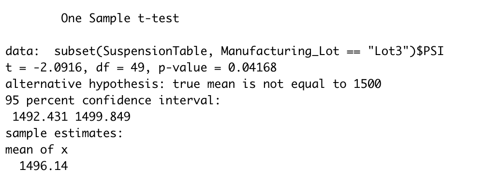

# **MechaCar_Statistical_Analysis**
*Use R and statistics to analyze vehical data*

## Linear Regression to Predict MPG:

1. Which variables/coefficients provided a non-random amount of variance to the mpg values in the dataset?

*vehicle_weight, spoiler_angle, and AWD*

2. Is the slope of the linear model considered to be zero? Why or why not?

*No, the slop of the linear model is not considered to be zero due to the p-value.*

3. Does this linear model predict mpg of MechaCar prototypes effectively? Why or why not?

*Yes (sort-of). The linear model will correctly predit mpg of MechaCar prototypes approximatly 71% of the time. This prediction comes from the Multiple R-Square. The Adjusted R-Squared is approximatly 68%. In addition to the 6 factors used in this model, there could be additional factors that would affect the prediction of MechaCar prototypes. Ultimatly, the effectiveness should be compared to a predetermined goal/measure of effectiveness.*

## Summary Statistics on Suspension Coils:

1. The design specifications for the MechaCar suspension coils dictate that the variance of the suspension coils must not exceed 100 pounds per square inch. Does the current manufacturing data meet this design specification for all manufacturing lots in total and each lot individually? Why or why not?

*The current manufacturing data for Lot1 and Lot2 does meet the design speicifications, however Lot3 does not as it's varianace goes beyond the design specifications.*

## T-Tests on Suspension Coils:

*The below images showcase the results of the T-test on Suspension Coils for ALL Lots, Lot1, Lot2, and Lot3 respectivly. Lot1 and Lot2 have a p-values above significance level. This can translate that these means are statisitacly similar to the population mean. Lot3 has a p-value below siginifical level and statistically different from the population mean. The t-test allows us to determine how similar or different the suspension coils are in each lot compared to the population mean.*

## Study Design: MechaCar vs Competition:

When it comes to car performance, there are many metrics in which consumers find of interest. Often the type of consumer desired can help determin the statistaical study. I think city/high fuel efficiency, cost, and maintenance cost are three factors that the average consutmer considers when purchasing a car. Data from MchaCar as well as data from close compeiotors could be gathered in order to perform a t-test, testing and comparing alternatives to the MechaCar. The null hypothesis would state that there is no differece between the studied metrics from MechaCar and the compeition. An alternative hypothesis would state that there is a difference between the studied metrics from MechaCar and the compeition. 
