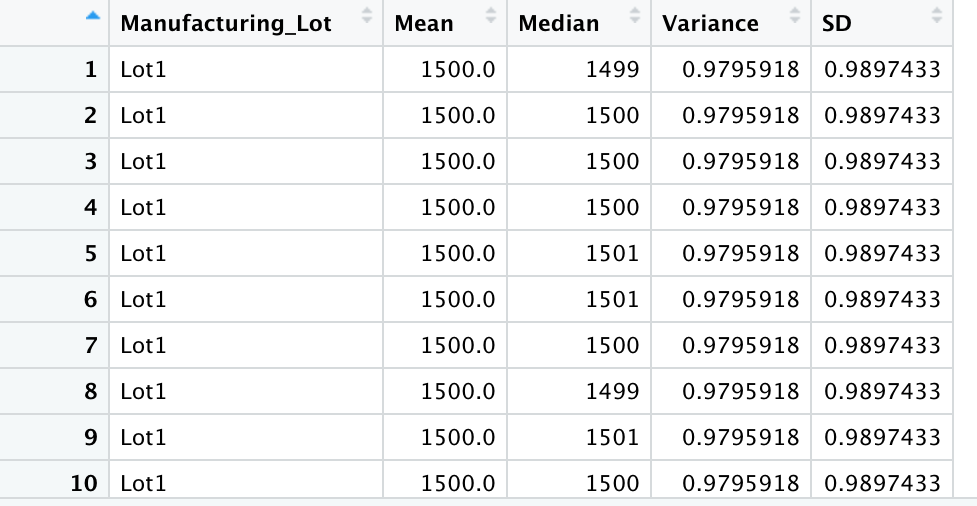

# **MechaCar_Statistical_Analysis**
*Use R and statistics to analyze vehival data*

## Linear Regression to Predict MPG:

1. Which variables/coefficients provided a non-random amount of variance to the mpg values in the dataset?

*vehicle_weight, spoiler_angle, and AWD*

2. Is the slope of the linear model considered to be zero? Why or why not?

*No, the slop of the linear model is not considered to be zero due to the p-value.*

3. Does this linear model predict mpg of MechaCar prototypes effectively? Why or why not?

*Yes (sort-of). The linear model will correctly predit mpg of MechaCar prototypes approximatly 71% of the time. This prediction comes from the Multiple R-Square. The Adjusted R-Squared is approximatly 68%. In addition to the 6 factors used in this model, there could be additional factors that would affect the prediction of MechaCar prototypes. Ultimatly, the effectiveness should be compared to a predetermined goal/measure of effectiveness.*

## Summary Statistics on Suspension Coils:

1. The design specifications for the MechaCar suspension coils dictate that the variance of the suspension coils must not exceed 100 pounds per square inch. Does the current manufacturing data meet this design specification for all manufacturing lots in total and each lot individually? Why or why not?

*answer goes here*

## T-Tests on Suspension Coils:

*then briefly summarize your interpretation and findings for the t-test results*

## Study Design: MechaCar vs Competition:

Write a short description of a statistical study that can quantify how the MechaCar performs against the competition. In your study design, think critically about what metrics would be of interest to a consumer: for a few examples, cost, city or highway fuel efficiency, horse power, maintenance cost, or safety rating.

In your description, address the following questions:
What metric or metrics are you going to test?
What is the null hypothesis or alternative hypothesis?
What statistical test would you use to test the hypothesis? And why?
What data is needed to run the statistical test?

The statistical study design has the following:
A metric to be tested is mentioned (5 pt)
A null hypothesis or an alternative hypothesis is described (5 pt)
A statistical test is described to test the hypothesis (5 pt)
The data for the statistical test is described (5 pt)

